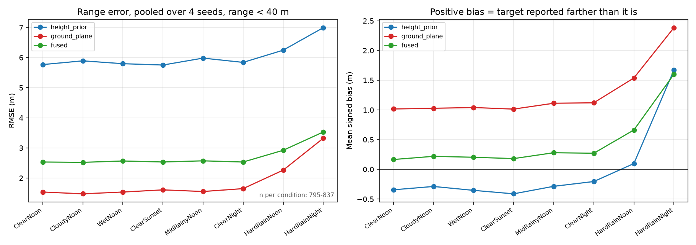
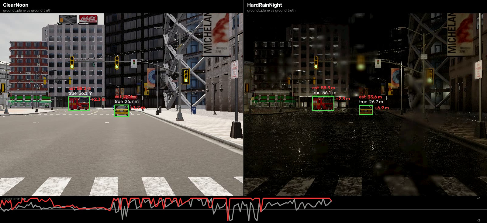
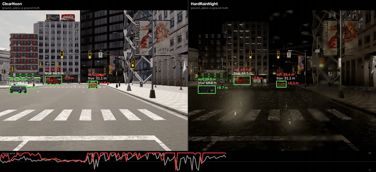

# Carla-Ranging-Validation

## Heavy rain/night makes ground-plane ranging more optimistic: capped RMSE rises 1.54 → 3.33 m and >250 ms TTC optimism rises 8% → 40%

A CARLA benchmark for camera-only vehicle ranging that measures detector recall, range error, TTC error, and brake timing — and explicitly checks whether apparent weather effects survive seed-level and range-band validation.

The perception front end is YOLO11s, COCO-pretrained and used zero-shot, with no fine-tuning on CARLA. Downstream range/TTC statistics are therefore conditional on detections that survive the detector, so detector behavior is reported alongside ranging rather than treated as a fixed upstream stage.

**Main result.** Pooling seeds 42, 43, 44, and 45 and restricting the headline comparison to `true_range_m < 40`, `ground_plane` RMSE rises from **1.54 m** in ClearNoon to **2.27 m** in HardRainNoon and **3.33 m** in HardRainNight. Mean signed bias rises from **+1.02 m** to **+1.54 m** to **+2.39 m**. From baseline to HardRainNight that is a **2.16× increase in RMSE** and a **2.34× increase in positive bias**.

Inside 40 m the retained sample count is nearly constant — **825 / 837 / 795** detections for ClearNoon / HardRainNoon / HardRainNight — so the capped comparison is much closer to like-for-like than the uncapped comparison. The cap also avoids leaning on unreliable far-field ground-plane geometry: in seed 43, **ClearNoon already has +5.44 m mean error at 60–90 m**, worse than several adverse-weather bands.

The downstream consequence is consistent across seeds. The share of TTC-window frames with optimistic `ground_plane` TTC error >250 ms rises from **8% in ClearNoon to 40% in HardRainNight**. Across seeds 42–45, ClearNoon ranges from **5.8–11.1%** while HardRainNight ranges from **29.8–52.8%**; the seed ranges do not overlap.

The range-band result is directional rather than a universal gradient. For every observed seed × range-band comparison, HardRainNight has a more positive mean `ground_plane` error than ClearNoon, but the magnitude depends strongly on seed. The data do **not** support a claim that degradation monotonically increases with distance.

## Why `ground_plane` fails

`ground_plane` estimates range from the bottom edge of the detected vehicle box under a flat-road assumption. That makes it sensitive to the image region around the tire-road contact point: reflections, glare, weak contrast, and small box-edge shifts can move the inferred contact point by a few pixels.

That pixel error becomes range error. In this experiment the retained detections are biased mostly positive: the vehicle is estimated too far away, TTC is overestimated, and a range-based brake trigger moves later.

`height_prior` behaves differently. It uses box height plus a class-height prior, so weather moves it less than `ground_plane`; its dominant error here is the prior itself. Both the fire truck and ambulance are mapped to a 3.20 m truck prior, while the Mustang is approximately 1.30 m tall against a 1.50 m car prior.

Detector dropout is a separate population-shift risk, but it is **not a universal seed-level mechanism** in these runs. In seed 45, HardRainNight removes distant, high-error detections strongly enough to reverse an uncapped range comparison. Seed 44 does not show the same pattern: it has **44 far-field detections in HardRainNight versus 20 in ClearNoon**. The repo therefore treats survivorship as something to test per seed, not as the headline explanation for every weather result.

## What is measured

The scenario is a fixed seeded route through 20 background NPCs plus one spawned stationary target, not a single-target scene. The detector sees all eligible vehicles along the route, and CARLA depth/actor state provide reference geometry.

The camera uses a 60° field of view (`fy ≈ 693 px`). With a 16 px minimum detected-box height, a 1.5 m car falls below the usable height floor beyond roughly 65 m. The spawned target begins around 90 m away, but it is not labelled/detected for this measurement until it is closer, so the effective ranging window is approximately 65 m to contact, not 90 m to contact.

The pipeline runs YOLO11s (COCO-pretrained, zero-shot, no CARLA fine-tuning) and evaluates three monocular range outputs:

- `ground_plane` — range from the box bottom edge and road-plane geometry
- `height_prior` — range from box height and a vehicle-height prior
- `fused` — uncertainty-weighted fusion of the two

CARLA depth and actor state provide the reference range. Closing speed comes from simulator ground truth, so TTC error isolates the contribution from range estimation rather than mixing in a separate velocity-estimation failure.

The TTC window is frames with `true TTC < 5 s`. Within that window, **597 of 645 vehicle observations (92%) are stationary vehicles**, typically about two stationary vehicles per run. That composition matters when interpreting TTC and braking results.

## Why TTC error instead of mAP?

mAP tells you whether the detector found the object and how well the box overlaps. It does not tell you whether a small box error makes the target look metres farther away, or whether that error moves a braking decision by hundreds of milliseconds.

Detector recall is still reported because missed detections change the population on which ranging is evaluated. The repo therefore reports both upstream detection behavior and downstream geometric consequences:

- detector recall by condition/seed
- range RMSE and signed bias, with a stated range cap for headline comparisons
- TTC error for frames with `true TTC < 5 s`
- fraction of TTC-window frames with optimistic TTC error >250 ms
- brake-trigger latency at the event level

# Results

## Range error: capped headline comparison

Seeds 42, 43, 44, and 45 are pooled. Headline range statistics use only detections with `true_range_m < 40`.

| Condition | n (`true_range_m < 40`) | `ground_plane` RMSE | Mean bias |
| --- | ---: | ---: | ---: |
| ClearNoon | 825 | **1.54 m** | **+1.02 m** |
| HardRainNoon | 837 | **2.27 m** | **+1.54 m** |
| HardRainNight | 795 | **3.33 m** | **+2.39 m** |

From ClearNoon to HardRainNight, RMSE increases **2.16×** and positive bias increases **2.34×**. The progression is monotone across the three severity anchors.

The cap is not cosmetic. Within 40 m the detector retains a near-constant number of observations across conditions (**825 / 837 / 795**), making the comparison substantially more like-for-like. Outside that region, far-field `ground_plane` error is already large in clean conditions and detector population shifts can distort uncapped comparisons. In seed 45 specifically, dropout removes distant high-error detections strongly enough to flatter HardRainNight; that behavior does not replicate in every seed.



## Range-band consistency — direction holds, gradient does not

The table below reports the HardRainNight minus ClearNoon difference in mean `ground_plane` range error by true-range band and seed.

| Range band | Seed 42 | Seed 43 | Seed 44 | Seed 45 |
| --- | ---: | ---: | ---: | ---: |
| 60–90 m | — | +0.33 m | **+8.25 m** | **+8.07 m** |
| 40–60 m | +1.29 m | +1.39 m | +4.47 m | +1.41 m |
| 20–40 m | +0.31 m | **+2.36 m** | +1.44 m | +0.82 m |
| 0–20 m | +0.48 m | +1.12 m | +0.38 m | +0.55 m |

Every **observed** seed × band difference is positive: HardRainNight makes `ground_plane` more optimistic than ClearNoon throughout the evaluated range. The magnitude, however, is seed-dependent.

The data do **not** support a universal distance gradient. Seed 43 is nearly flat at 60–90 m (**+0.33 m**) and peaks at 20–40 m (**+2.36 m**). Seed 45's +8.07 m far-field difference rests on only **n=5**. Seed 42 has no 60–90 m estimate. Two seeds show a strong far-field increase, one contradicts the proposed gradient, and one has no far-field data.

A second reason not to make the far field the headline is that clean-weather `ground_plane` ranging is already poor there: **ClearNoon at 60–90 m has +5.44 m mean error in seed 43**. That independently supports the 40 m headline cap.

## Detector recall

Detector recall degrades in adverse conditions, but the downstream survivorship pattern is not identical across seeds. As anchor examples, seed 42 falls from **97.1% to 81.6%** from ClearNoon to HardRainNight, while seed 45 falls from **89.2% to 55.4%**.

The important interpretation is not that heavy rain always deletes the same distant population. It is that missed detections can change which observations reach the range/TTC evaluator, so seed-level population checks are required before interpreting uncapped downstream metrics.

## TTC consequence

| Result | Finding |
| --- | --- |
| TTC window | Frames with `true TTC < 5 s` |
| `ground_plane`, optimistic TTC error >250 ms | **8% → 40%** of TTC-window frames from ClearNoon to HardRainNight |
| Seed consistency | ClearNoon: **5.8–11.1%**; HardRainNight: **29.8–52.8%** across seeds 42–45; no overlap |
| TTC-window composition | **597/645 (92%)** stationary-vehicle observations, typically about two per run |
| `height_prior` | Seed-level results overlap |
| `fused` | Seed-level results overlap |
| Brake latency | 5 events across four seeds; observed effect is only 1.2× the seed spread |

The frame-level range and TTC results contain many observations, but they are not independent of detector behavior or scene composition. Brake latency is useful as a downstream interpretation; with only five events across four seeds, it is reported rather than claimed as a robust effect.

## Qualitative comparison

Static frame:



GitHub-renderable animation:



The source video is generated locally by `src/make_video.py` as `results/comparison.avi` and is gitignored; the committed PNG and GIF are the repository-host-friendly views.

## Condition matrix

The experiment sweeps eight weather/lighting conditions from the clean baseline through heavy rain and night. The key severity anchors reported above are:

- ClearNoon
- HardRainNoon
- HardRainNight

The complete matrix and severity ordering live in `configs/conditions.yaml`; both capture and analysis read the same configuration. All reported runs use `-quality-level=Low`, so every result is conditioned on that CARLA renderer setting.

## What this does not prove

This repo does not claim that:

- range degradation grows monotonically with distance — the seed-level range-band gradient does not replicate
- adverse weather always removes a disproportionately distant population — the strong survivorship reversal is demonstrated in seed 45, not every seed
- the degradation is concentrated only in the near field — positive HardRainNight–ClearNoon differences occur across observed bands
- brake latency is statistically well powered — there are only five events across four seeds
- `height_prior` or `fused` separate cleanly across seeds — they do not
- weather is the main source of `height_prior` error — class-prior mismatch dominates it here
- the result generalises beyond this map, fixed seeded route, 20 background NPCs plus one spawned stationary target, camera, detector, or `-quality-level=Low` rendering configuration
- the TTC window is a pure moving-lead-vehicle benchmark — 597/645 observations (92%) are stationary vehicles
- TTC numbers include closing-speed estimation uncertainty — closing speed comes from ground truth
- CARLA rain/night rendering is photometrically equivalent to real weather

# Reproduce

## Requirements

| Requirement | Setup |
| --- | --- |
| OS | Windows 10/11 |
| CARLA | 0.9.15 |
| GPU | NVIDIA, 6 GB VRAM minimum |
| CPU | 6+ cores recommended |
| RAM | 16 GB minimum |
| Disk | ~30 GB free |
| Python | Conda/Miniforge |

The repo uses two environments:

- `carla38` — Python 3.8 + CARLA API
- `percep` — YOLO11s + NumPy/pandas/PyTorch/analysis

They communicate through generated dataset/result directories (`dataset/`, `dataset_s*/`, `results/`, `results_s*/`, and `results_pooled/`).

## One-time setup

```powershell
Set-ExecutionPolicy -Scope Process -ExecutionPolicy Bypass

conda env create -f environment\carla38.yml
conda env create -f environment\percep.yml
```

Set `CARLA_ROOT` to the CARLA 0.9.15 install directory. If Defender real-time scanning slows capture, exclude the generated datasets:

```powershell
Add-MpPreference -ExclusionPath (Join-Path (Get-Location) "dataset")
Add-MpPreference -ExclusionPath (Join-Path (Get-Location) "dataset_s43")
Add-MpPreference -ExclusionPath (Join-Path (Get-Location) "dataset_s44")
Add-MpPreference -ExclusionPath (Join-Path (Get-Location) "dataset_s45")
```

## Start CARLA

```powershell
.\scripts\preflight.ps1
.\scripts\start_server.ps1
.\scripts\preflight.ps1
```

The reported experiment used CARLA with `-quality-level=Low`. Preserve that renderer setting in `start_server.ps1` or the underlying `CarlaUE4.exe` launch command. The second preflight is intentional because some checks require a live CARLA server.

## Run the full experiment

The reference experiment uses 300 frames per capture and seeds 42, 43, 44, and 45.

`run_all.ps1` runs the end-to-end pipeline for the default seed (42), including detector inference and `src.make_headline`; 300 frames is the default:

```powershell
.\run_all.ps1
```

Capture the remaining seeded matrices:

```powershell
.\scripts\run_matrix.ps1 -Seed 43 -Out .\dataset_s43
.\scripts\run_matrix.ps1 -Seed 44 -Out .\dataset_s44
.\scripts\run_matrix.ps1 -Seed 45 -Out .\dataset_s45
```

The equivalent pattern for another seed is:

```powershell
.\scripts\run_matrix.ps1 -Seed N -Out .\dataset_sN
```

## Labels, detection, evaluation, and pooling for seeds 43–45

Each additional seed goes through labels → YOLO11s detection → ranging/evaluation, then all four result directories are pooled.

```powershell
foreach ($s in 43,44,45) { Get-ChildItem ".\dataset_s$s" -Directory | ForEach-Object { conda run -n percep python -m src.labels --run $_.FullName } }
foreach ($s in 43,44,45) { conda run --no-capture-output -n percep python -m src.detect --dataset ".\dataset_s$s" }
foreach ($s in 43,44,45) { conda run --no-capture-output -n percep python -m src.evaluate --dataset ".\dataset_s$s" --labels detections.json --out ".\results_s$s" }
conda run --no-capture-output -n percep python -m src.pool_seeds --results results results_s43 results_s44 results_s45
```

Reproduce the published 40 m capped headline table:

```powershell
conda run -n percep python -c "import pandas as pd;d=pd.concat([pd.read_parquet(f'results{s}/detections.parquet') for s in ['','_s43','_s44','_s45']]).query('true_range_m<40');print(d.groupby('condition').apply(lambda g:pd.Series({'n':len(g),'rmse':(g.ground_plane_err_m**2).mean()**0.5,'bias':g.ground_plane_err_m.mean()})).round(2).reindex(['ClearNoon','HardRainNoon','HardRainNight']))"
```

Expected headline output:

```text
                  n  rmse  bias
condition
ClearNoon      825.0  1.54  1.02
HardRainNoon   837.0  2.27  1.54
HardRainNight  795.0  3.33  2.39
```

A single 300-frame matrix is roughly 10 minutes on the reference machine. Reproducing all four seeds plus the CPU detector passes is roughly one hour end to end, excluding one-time environment setup.

The determinism check compares ego/NPC state and trajectory, not sensor-file hashes. Exact sensor bytes are not required; controlled simulator state is.

## Pipeline

| Stage | What it does | Acceptance check |
| --- | --- | --- |
| Determinism | repeats controlled runs | ego/NPC state and trajectory agree |
| Capture matrix | sweeps weather/lighting conditions across seeds | route and traffic state stay comparable |
| Labels | builds depth/semantic reference labels | overlays and diagnostics look correct |
| Detection | runs zero-shot COCO-pretrained YOLO11s | recall is reported; missing detections are not silently ignored |
| Ranging | computes `ground_plane`, `height_prior`, and `fused` | outputs are complete and internally consistent |
| Evaluation | computes range error, TTC error, and brake latency | TTC window is `true TTC < 5 s`; population shifts are checked |
| Seed pooling | aggregates four runs without hiding spread | capped headline stats and seed spread are both visible |
| Report | writes figures, result tables, and comparison media | numbers match pooled outputs and the stated 40 m headline cap |

# Repository layout

## Capture / CARLA side

- `run_all.ps1` — orchestrates the complete pipeline.
- `scripts/preflight.ps1` — checks CARLA, environments, hardware assumptions, disk space, and live-server dependencies.
- `scripts/start_server.ps1` — starts `CarlaUE4.exe` and waits for RPC; reported results use `-quality-level=Low`.
- `scripts/carla_capture.py` — synchronous capture, seeded actors, sensor frames, and per-frame ground truth.
- `scripts/run_matrix.ps1` — sweeps the configured condition matrix.
- `scripts/verify_determinism.py` — compares ego/NPC state and trajectory across repeated runs.
- `scripts/diagnose_labels.py` — targeted diagnostics for suspicious ground-truth labels.
- `scripts/depth_edge_test.py` — checks depth discontinuities around object boundaries.

## Perception / analysis side

- `src/config.py` — loads `configs/conditions.yaml`.
- `src/labels.py` — projects actors into the image and builds depth/semantic reference labels.
- `src/detect.py` — runs YOLO11s, COCO-pretrained, zero-shot, with no CARLA fine-tuning.
- `src/ranging.py` — implements `ground_plane`, `height_prior`, uncertainty models, and fusion.
- `src/evaluate.py` — converts range error into TTC error and brake-trigger timing.
- `src/pool_seeds.py` — pools four seeded runs while preserving seed spread.
- `src/make_headline.py` — generates the published 40 m pooled headline artifacts from the pooled seed outputs.
- `src/inspect_labels.py` — creates quick visual checks for label quality.
- `src/make_video.py` — renders the qualitative comparison video.
- `src/report.py` — generates single-seed figures and result tables.
- `check_errors.py` — computes per-range-band error comparisons between conditions for seed-level validation.

## Config / tests / outputs

- `configs/conditions.yaml` — eight-condition weather/lighting matrix and severity ordering.
- `tests/test_geometry.py` — synthetic geometry tests; no CARLA server required.
- `environment/carla38.yml` — CARLA-side environment.
- `environment/percep.yml` — detector/analysis environment.
- `results/fig1_range_error_pooled_40m.png` — committed four-seed, 40 m capped headline range-error figure.
- `results/comparison_frame.png` — committed static GitHub-renderable comparison frame.
- `results/comparison.gif` — committed GitHub-renderable qualitative comparison excerpt.
- `results/comparison.avi` — generated source video; gitignored and not present in a normal clone.
- `results_pooled/range_pooled_40m.csv` — committed pooled 40 m headline range statistics.
- `results_pooled/range_band_by_seed.csv` — committed seed-level range-band comparison data.
- `results_pooled/recall_by_seed.csv` — committed seed-level detector recall summary.
- `dataset/`, `dataset_s*/` — generated capture data; gitignored.
- `results_s*/` — generated seed-specific analysis outputs; gitignored.
- `results_pooled/` — contains the committed compact pooled summary CSVs listed above.

# Validation engineering: claims the data rejected

The strongest part of this benchmark is not a single effect size; it is the sequence of plausible claims that were tested against seed-level data and rejected when they did not hold.

| Hypothesis | Validation outcome |
| --- | --- |
| **Z² crossover** | Not supported. `height_prior` was predicted to beat `ground_plane` at distance because ground-plane uncertainty grows approximately as Z²; it does not beat `ground_plane` in any evaluated range band in any seed. |
| **Near-field concentration** | Not supported. HardRainNight–ClearNoon `ground_plane` differences are positive across observed range bands, not confined to the near field. |
| **Universal survivorship mechanism** | Not supported. Seed 45 shows strong distant high-error dropout, but seed 44 has more far-field detections in HardRainNight (44) than ClearNoon (20). |
| **Range degradation grows monotonically with distance** | Not supported. Seed 43 peaks at 20–40 m and is nearly flat at 60–90 m; seed 45's far-field estimate is based on `n=5`. |

These failures are useful. Each claim was decided by an executable check rather than by choosing the most convenient interpretation. The final result is therefore narrower but stronger: within 40 m, pooled `ground_plane` error increases monotonically with severity, and at the seed/range-band level the **direction** of the HardRainNight shift is consistent while its **magnitude and distance profile are seed-dependent**.

Earlier development also exposed implementation/evaluation traps that could have produced convincing but wrong results:

- **Reference-point mismatch.** The projected 2D box was effectively tied to the near face of the 3D box while true range was taken to the centroid, creating about 2.4 m of systematic offset.
- **Wrong variation pooled in a degradation check.** Variation between estimators was mixed with variation between conditions, allowing a weather-insensitive result to pass.
- **Closing-speed filter command bug.** A bug in an analysis command affected the closing-speed-filter check; it was an implementation issue, not a system-level hypothesis, and is not used as part of the result.
- **Seed-specific survivorship reversal.** In seed 45, HardRainNight loses 107 of 282 detections; the missing detections are disproportionately distant and high-error, enough to reverse an uncapped comparison.

These are the kinds of validation failures that produce plausible numbers instead of exceptions. The tests and diagnostic scripts in this repo exist largely to catch that class of failure.

# Limitations

- **Headline range metrics are range-capped.** The main comparison uses `true_range_m < 40`. This improves population comparability and avoids leaning on a far field where `ground_plane` is already unreliable in clean weather.
- **Detector behavior is seed-dependent.** Recall degrades under adverse weather, but the distance distribution of dropout is not universal across seeds.
- **The range-band direction is stronger than the range-band shape.** Observed HardRainNight–ClearNoon differences are positive across bands, but there is no reproducible monotonic range gradient.
- **Brake latency is underpowered.** There are only five events across four seeds, with an observed effect only 1.2× the seed spread.
- **Only `ground_plane` separates cleanly across seeds.** `height_prior` and `fused` overlap.
- **`height_prior` is prior-limited.** Its error is dominated by class-height mismatch rather than weather.
- **The scenario is controlled but not single-target-only.** It is one map and one fixed seeded route through 20 background NPCs plus one spawned stationary target.
- **The TTC window is mostly stationary vehicles.** 597/645 observations (92%) in frames with `true TTC < 5 s` are stationary vehicles.
- **The effective measurement range is ~65 m to contact, not 90 m.** At 60° FOV (`fy ≈ 693`), a 1.5 m car falls below the 16 px height floor beyond roughly 65 m.
- **All results are conditioned on `-quality-level=Low`.** A different CARLA rendering quality may change detector and image-error behavior.
- **Closing speed comes from ground truth.** TTC error excludes velocity-estimation error and should be read as a lower bound for a fully estimated stack.
- **CARLA weather is not photometrically validated against the real world.** The simulator supports controlled relative comparisons; the absolute degradation should not be transferred directly to real rain or night driving.
