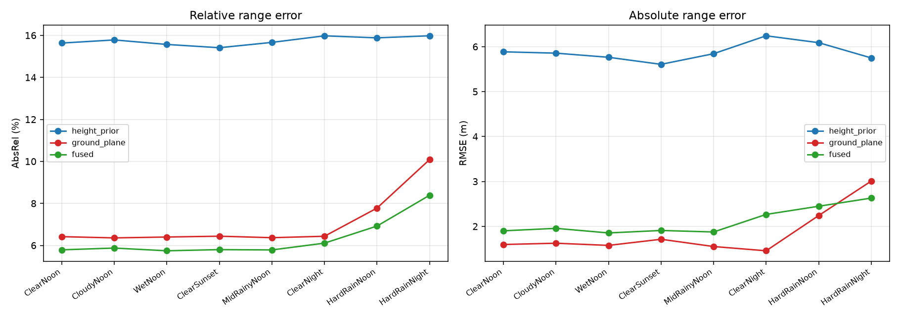

# carla-ranging-validation

**When does monocular range estimation become unsafe in bad weather?**

A CARLA benchmark for camera-only vehicle ranging that measures failure in **range error, TTC error, and brake timing**, not detector mAP.

**Main result:** `ground_plane` range RMSE rises from **2.16 m in `ClearNoon` to 3.97 m in `HardRainNight` (1.84×)**, while mean bias grows from **+1.05 m to +2.64 m (2.5×)**. The bias is positive, so the estimator reports the target as **farther away than it really is** — exactly the direction that produces optimistic TTC and late braking.



The same failure shows up in TTC: for `ground_plane`, the share of approach frames with **optimistic TTC error >250 ms** rises from **8% in `ClearNoon` to 40% in `HardRainNight`**. Across seeds **42, 43, 44, and 45**, `ClearNoon` ranges from **5.8–11.1%**, while `HardRainNight` ranges from **29.8–52.8%**. The ranges do not overlap — every seed shows the effect.

## Why it fails

`ground_plane` estimates range from the **bottom edge of the detected vehicle box** under a flat-road assumption. That makes it sensitive to exactly the image region that gets messy in adverse weather: wet asphalt, headlight reflections, glare, and weak tire-road contrast can move the apparent contact point downward or upward by a few pixels.

That pixel error turns into range error. In this experiment the error is mostly **positive**: the target is estimated too far away, so TTC is overestimated and the brake trigger moves later.

`height_prior` behaves differently. It uses the detected box **height** plus a class-height prior, so it barely moves with weather compared with `ground_plane`. Its dominant error here is the class prior itself, not the weather condition.

## What is measured

The pipeline runs a real vehicle detector, then evaluates three monocular range outputs:

* `ground_plane` — range from the box bottom edge and road-plane geometry
* `height_prior` — range from box height and a vehicle-height prior
* `fused` — uncertainty-weighted fusion of the two

CARLA depth and actor state provide the reference range. Closing speed comes from simulator ground truth, so TTC error isolates the contribution from **range estimation** rather than mixing in a separate velocity-estimation failure.

### Why TTC error instead of mAP?

mAP tells you whether the detector found the object and how well the box overlaps. It does not tell you whether a small box error makes the target look 2–4 m farther away, or whether that error moves a braking decision by a few hundred milliseconds.

That is why this repo reports:

* range RMSE and signed bias
* TTC error
* fraction of approach frames with optimistic TTC error >250 ms
* brake-trigger latency at the event level

## Results

### Range error: the strongest result

Seeds **42, 43, 44, and 45** are pooled, with roughly **1,100 valid frames per condition**.

| Condition       | `ground_plane` RMSE |   Mean bias |
| --------------- | ------------------: | ----------: |
| `ClearNoon`     |          **2.16 m** | **+1.05 m** |
| `HardRainNoon`  |          **2.78 m** | **+1.64 m** |
| `HardRainNight` |          **3.97 m** | **+2.64 m** |

From `ClearNoon` to `HardRainNight`, RMSE increases **1.84×** and positive bias increases about **2.5×**. The degradation is monotone across these severity anchors and is consistent with the TTC result below.

### TTC consequence

| Result                                       | Finding                                                                                        |
| -------------------------------------------- | ---------------------------------------------------------------------------------------------- |
| `ground_plane`, optimistic TTC error >250 ms | **8% → 40%** of approach frames from `ClearNoon` to `HardRainNight`                            |
| Seed consistency                             | `ClearNoon`: **5.8–11.1%**; `HardRainNight`: **29.8–52.8%** across seeds **42–45**; no overlap |
| `height_prior`                               | Seed-level results overlap                                                                     |
| `fused`                                      | Seed-level results overlap                                                                     |
| Brake latency                                | **n=5 events per condition**; observed effect is only **1.2× the seed spread**                 |

The frame-level range and TTC results are well powered. Brake latency is useful as a downstream interpretation, but with only five events per condition it is **reported, not claimed as a robust effect**.

## Condition matrix

The experiment sweeps eight weather/lighting conditions from the clean baseline through heavy rain and night. The key severity anchors reported above are:

* `ClearNoon`
* `HardRainNoon`
* `HardRainNight`

The complete matrix and its severity ordering live in `configs/conditions.yaml`; both the CARLA capture side and the analysis side read the same configuration.

## What this does *not* prove

This repo does not claim that:

* brake latency is statistically well powered — there are only five events per condition
* `height_prior` or `fused` separate cleanly across seeds — they do not
* weather is the main source of `height_prior` error — class-prior mismatch dominates it here
* the result generalises beyond this map, route, camera, and stationary target
* the TTC numbers include closing-speed estimation uncertainty — closing speed comes from ground truth
* CARLA rain/night rendering is photometrically equivalent to real weather

## Reproduce

### Requirements

| Requirement | Setup                     |
| ----------- | ------------------------- |
| OS          | Windows 10/11             |
| CARLA       | 0.9.15                    |
| GPU         | NVIDIA, 6 GB VRAM minimum |
| CPU         | 6+ cores recommended      |
| RAM         | 16 GB minimum             |
| Disk        | ~30 GB free               |
| Python      | Conda/Miniforge           |

The repo uses two environments:

* `carla38` — Python 3.8 + CARLA API
* `percep` — detector + NumPy/pandas/PyTorch/analysis

They communicate through files in `dataset/`.

### One-time setup

```powershell
Set-ExecutionPolicy -Scope Process -ExecutionPolicy Bypass

conda env create -f environment\carla38.yml
conda env create -f environment\percep.yml
```

Set `CARLA_ROOT` to the CARLA 0.9.15 install directory, then exclude the generated dataset from Defender if real-time scanning is slowing capture:

```powershell
Add-MpPreference -ExclusionPath (Join-Path (Get-Location) "dataset")
```

### Start CARLA

```powershell
.\scripts\preflight.ps1
.\scripts\start_server.ps1
.\scripts\preflight.ps1
```

The second preflight is intentional: some checks require a live CARLA server.

### Run the full experiment

The reference experiment uses **300 frames per capture** and four seeds: **42, 43, 44, and 45**.

`run_all.ps1` runs the end-to-end pipeline for the default seed (**42**):

```powershell
.\run_all.ps1 -Frames 300
```

Capture the remaining seeded matrices separately so each run has its own output directory:

```powershell
.\scripts\run_matrix.ps1 -Seed 43 -Out .\dataset_s43
.\scripts\run_matrix.ps1 -Seed 44 -Out .\dataset_s44
.\scripts\run_matrix.ps1 -Seed 45 -Out .\dataset_s45
```

The equivalent pattern for any seed is:

```powershell
.\scripts\run_matrix.ps1 -Seed N -Out .\dataset_sN
```

A single 300-frame matrix is roughly **10 minutes** on the reference machine. Reproducing all four seeds plus the four CPU detector passes (about **8 minutes each**) is **about one hour end to end**, excluding one-time environment setup.

The determinism check compares **ego/NPC state and trajectory**, not sensor-file hashes. Exact bytes are not required; controlled simulator state is.

## Pipeline

| Stage          | What it does                                         | Acceptance check                               |
| -------------- | ---------------------------------------------------- | ---------------------------------------------- |
| Determinism    | repeats controlled runs                              | ego/NPC state and trajectory agree             |
| Capture matrix | sweeps weather/lighting conditions across seeds      | route and traffic state stay comparable        |
| Labels         | builds depth/semantic reference labels               | overlays and diagnostics look correct          |
| Detection      | runs the detector used by the experiment             | detections and label diagnostics pass          |
| Ranging        | computes `ground_plane`, `height_prior`, and `fused` | outputs are complete and internally consistent |
| Evaluation     | computes range error, TTC error, and brake latency   | no missing/invalid approach events             |
| Seed pooling   | aggregates the four runs without hiding spread       | endpoint separation is visible where claimed   |
| Report         | writes figures and result tables                     | numbers match pooled outputs                   |

## Repository layout

### Capture / CARLA side

* `run_all.ps1` — orchestrates the complete pipeline.
* `scripts/preflight.ps1` — checks the CARLA install, environments, hardware assumptions, disk space, and live-server dependencies.
* `scripts/start_server.ps1` — starts `CarlaUE4.exe` and waits for RPC to respond.
* `scripts/carla_capture.py` — synchronous capture, seeded actors, sensor frames, and per-frame ground truth.
* `scripts/run_matrix.ps1` — sweeps the configured condition matrix.
* `scripts/verify_determinism.py` — compares ego/NPC state and trajectory across repeated runs.
* `scripts/diagnose_labels.py` — targeted diagnostics for suspicious ground-truth labels.
* `scripts/depth_edge_test.py` — checks depth discontinuities around object boundaries.

### Perception / analysis side

* `src/config.py` — loads `configs/conditions.yaml`.
* `src/labels.py` — projects actors into the image and builds depth/semantic reference labels.
* `src/detect.py` — runs the vehicle detector used by the benchmark.
* `src/ranging.py` — implements `ground_plane`, `height_prior`, uncertainty models, and fusion.
* `src/evaluate.py` — converts range error into TTC error and brake-trigger timing.
* `src/pool_seeds.py` — pools the four seeded runs while preserving seed spread.
* `src/inspect_labels.py` — creates quick visual checks for label quality.
* `src/report.py` — generates figures and result tables.

### Config / tests / outputs

* `configs/conditions.yaml` — eight-condition weather/lighting matrix and severity ordering.
* `tests/test_geometry.py` — synthetic geometry tests; no CARLA server required.
* `environment/carla38.yml` — CARLA-side environment.
* `environment/percep.yml` — detector/analysis environment.
* `results/RESULTS.md` — measured result summary.
* `results/fig1_range_error_vs_severity.png` — headline range-error figure.
* `dataset/` — generated capture data; gitignored.

## What broke during development

Several bugs were found by testing against known answers rather than trusting plausible-looking plots. Two were especially important because neither caused a crash.

1. **Range was referenced to the wrong part of the vehicle.** The projected 2D box was effectively tied to the near face of the 3D box, while true range was taken to the centroid. That introduced about **2.4 m** of systematic offset — larger than the weather effect being measured — and initially looked like an estimator problem.

2. **The degradation check pooled the wrong variation.** The original “no failure boundary” check mixed variation between estimators with variation between conditions. Estimators could differ strongly while weather had no effect, and the check would still pass.

Both are the kind of validation bug that produces convincing numbers instead of exceptions. The tests and diagnostic scripts in this repo exist largely to catch that class of failure.

## Limitations

* **Brake latency is underpowered.** `n=5` events per condition, with an effect only **1.2× the seed spread**. It is reported, not treated as a strong claim.
* **Only `ground_plane` separates cleanly across seeds.** `height_prior` and `fused` overlap.
* **`height_prior` is prior-limited.** Its error is dominated by class-height mismatch rather than weather.
* **One stationary target, one map, one route.** This is a controlled failure study, not a generalisation benchmark.
* **Closing speed comes from ground truth.** TTC error therefore excludes velocity-estimation error and should be read as a **lower bound** for a fully estimated stack.
* **CARLA weather is not photometrically validated against the real world.** The simulator is useful for controlled relative comparisons; the absolute degradation should not be transferred directly to real rain or night driving.
